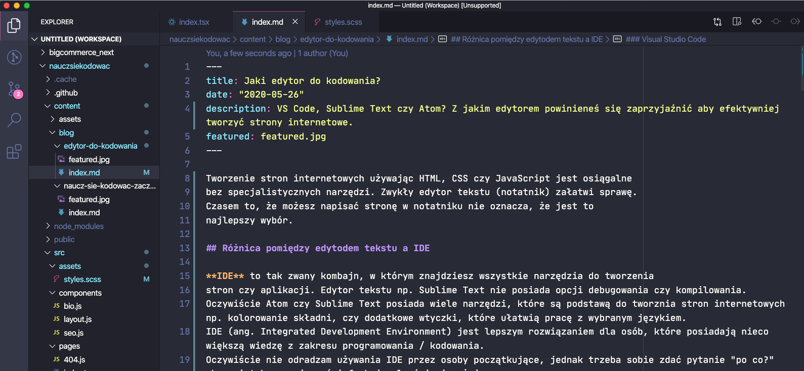

Tworzenie stron internetowych używając HTML, CSS czy JavaScript jest osiągalne
bez specjalistycznych narzędzi. Zwykły edytor tekstu (notatnik) załatwi sprawę.
Czasem to, że możesz napisać stronę w notatniku nie oznacza, że jest to 
najlepszy wybór.

## Różnica pomiędzy edytodem tekstu a IDE

**IDE** to tak zwany kombajn, w którym znajdziesz wszystkie narzędzia do tworzenia
stron czy aplikacji. Edytor tekstu np. Sublime Text nie posiada opcji debugowania czy kompilowania.
Oczywiście Atom czy Sublime Text posiada wiele narzędzi, które są podstawą do tworznia stron internetowych np. kolorowanie składni, czy dodatkowe wtyczki, które ułatwią pracę z wybranym językiem.
IDE (ang. Integrated Development Environment) jest lepszym rozwiązaniem dla osób, które posiadają nieco większą wiedzę z zakresu programowania / kodowania. 
Oczywiście nie odradzam używania IDE przez osoby początkujące, jednak trzeba sobie zdać pytanie "po co?" skoro i tak sporej części funkcjonalności nie użyjemy.

Na rynku jest sporo edytorów tekstów oraz IDE, dzisiaj pominę listę "kombajnów" czyli IDE i skupię się
tylko na edytorach tekstu.

### Visual Studio Code

